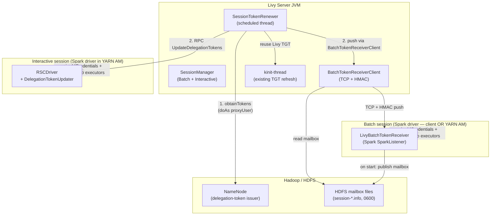
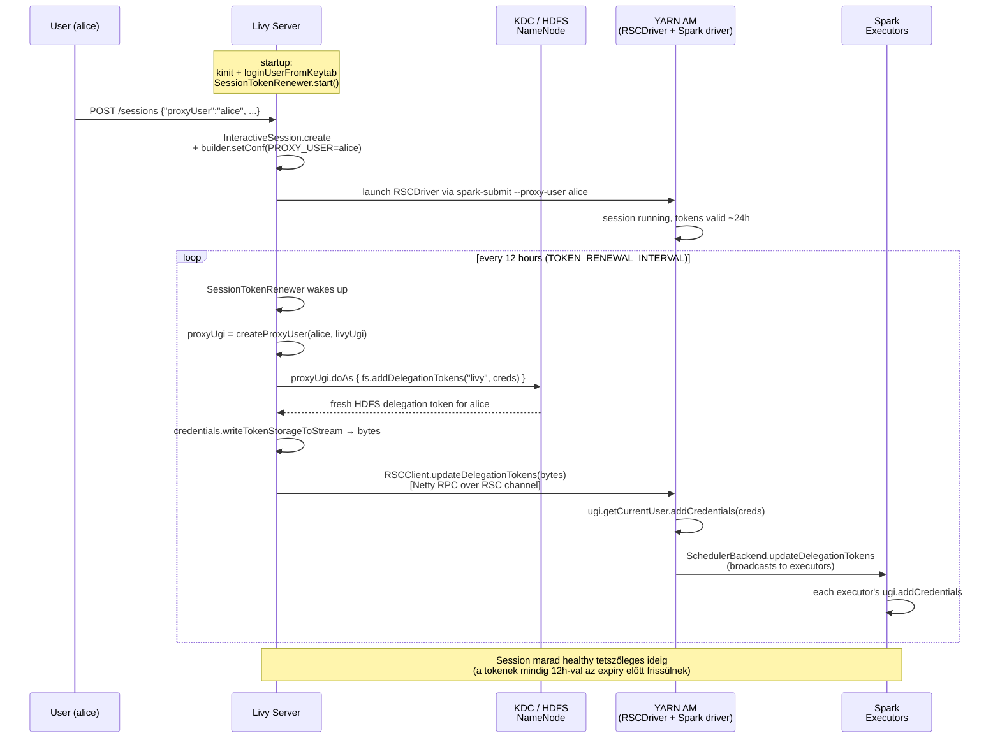
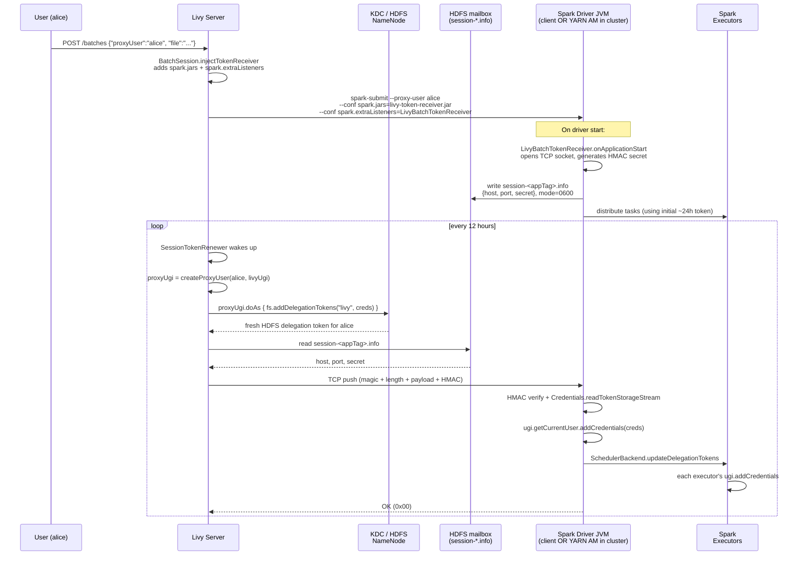
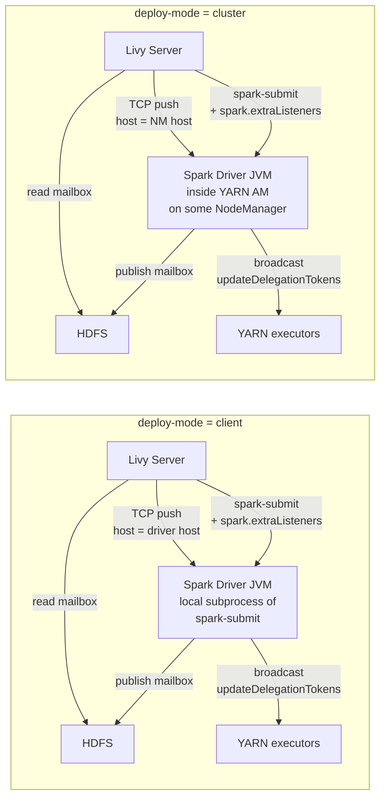
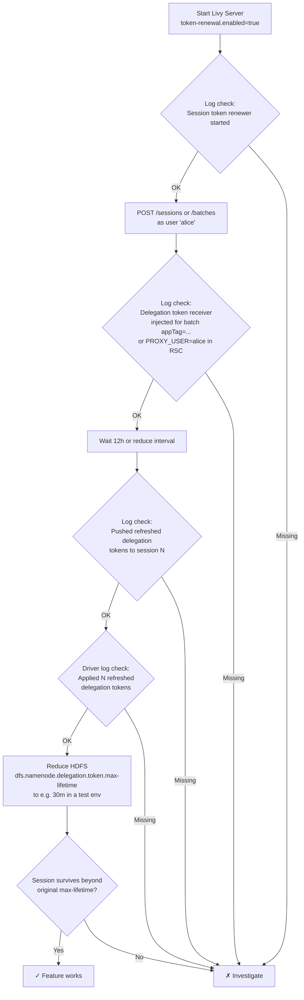

# Kerberos Delegation Token megújítás Apache Livy-ben

> Ez a dokumentum részletesen elmagyarázza, hogyan működik az új Livy szerver
> oldali delegation-token megújító mechanizmus, folyamatábrákkal és
> szekvencia-diagrammokkal. A Mermaid blokkok automatikusan renderelődnek
> GitHub-on, GitLab-on, Notion-ben, vagy [mermaid.live](https://mermaid.live)-on.
> Google Docs-ba beillesztéshez másold a Mermaid blokkokat mermaid.live-ba,
> exportáld PNG-ként, majd illeszd be a Docs-ba.

---

## 1. A probléma

A Hadoop delegation-tokenek (HDFS, Hive, HBase) korlátozott élettartamúak
(alapból ~24 óra renew-interval, ~7 nap max-lifetime). Egy hosszan futó Livy
session Spark-drivere a saját tokenjeivel dolgozik: amikor ezek lejárnak, a
session elveszíti a HDFS/Hive/HBase hozzáférést. Livy eddig **semmilyen
token-renewal-t nem végzett** a batch és interactive session-ök számára.

A cél:

- **A Livy service keytab sose kerüljön a proxy user (pl. `alice`) hozzáférési útjába.**
  Ezért nem használunk `--principal`/`--keytab` átadást a `spark-submit`-nek —
  az Spark HDFS staging-dir-be feltöltené a keytab-ot, ahonnan a proxy user
  hozzáférhetne.
- Livy szerver oldalán fusson egy **renewer szolgáltatás**, amely a saját
  service keytab-jával periódikusan **friss delegation-tokeneket szerez a
  proxy user nevében**, majd RPC-n átküldi a Spark driver-nek.
- A Spark driver a saját `SchedulerBackend.updateDelegationTokens(...)`
  API-ját használva **szétosztja az új tokeneket az executor-oknak**.
- Ez működjön **batch és interactive** session-re egyaránt.
- Működjön **spark client és cluster módban** egyaránt.

---

## 2. Nagy kép: komponensek és felelősségek



**Kulcskomponensek:**

| Komponens | Hol fut | Mit csinál |
|---|---|---|
| `SessionTokenRenewer` | Livy server JVM | Periódikus (default 12h) delegation-token szerzés minden aktív session-re és RPC-n való push. |
| `BatchTokenReceiverClient` | Livy server JVM | HDFS mailbox olvasása → TCP+HMAC push a batch driver felé. |
| `LivyBatchTokenReceiver` | Batch Spark driver JVM | Spark listener; nyit egy TCP socket-et, mailbox-ba írja a címét, fogadja a token push-ot. |
| `RSCDriver` handle-ja (`UpdateDelegationTokens`) | Interactive Spark driver JVM (YARN AM) | Deszerializálja a Credentials-t, UGI-ra teszi + Spark scheduler backend-nek továbbítja. |
| `DelegationTokenUpdater` | RSC driver oldalán | Közös segéd — `Credentials` deszerializálás + reflection `SchedulerBackend.updateDelegationTokens`. |

---

## 3. Interactive session — token megújítási folyamatábra



**Miért működik:**

- **Livy service principal** (`livy/host@REALM`) Hadoop superuser (a
  `core-site.xml`-ben: `hadoop.proxyuser.livy.hosts=*`,
  `hadoop.proxyuser.livy.groups=*`). Így tudja alice nevében kikérni a
  HDFS delegation-tokent — de nélküle alice-nek nem lenne módja arra.
- Az **RSC csatorna** már létezik interaktív session-höz (Netty-alapú, DIGEST-MD5
  SASL, per-session random secret) — az `UpdateDelegationTokens` üzenet
  ugyanolyan hitelesített csatornán utazik mint a többi RSC üzenet.

---

## 4. Batch session — token megújítási folyamatábra

Batch session esetén nincs meglévő RSC csatorna a driver felé. Új mechanizmust
kell felépítenünk, viszont a felhasználó **nem férhet hozzá a Livy keytab-hoz**,
és a **client és cluster módban** egyaránt működnie kell. A megoldás:

1. A `livy-token-receiver.jar` egy kis független library, amit a Livy dist-tel
   szállítunk. Tartalmaz egy Spark `SparkListener`-t.
2. Livy minden batch session-höz automatikusan hozzáadja ezt a listener-t
   (`spark.extraListeners`) és a JAR-t (`spark.jars`). Így a driver JVM-ben
   fut, client és cluster módban egyaránt.
3. A listener felkészültségekor (`onApplicationStart`):
   - Nyit egy TCP socket-et random ephemeral porton
   - Generál egy 32 byte-os random HMAC secret-et
   - HDFS-re ír egy mailbox fájlt `<mailbox-dir>/session-<appTag>.info` néven,
     `0600` permission-nel, tartalma JSON: `{host, port, secret}`
4. Livy `SessionTokenRenewer` a HDFS mailbox-ot olvassa, tudja a driver
   host:port:secret-jét, HMAC-cal aláírt TCP payload-dal átküldi a friss
   Credentials bájtokat.
5. A listener HMAC-cal ellenőriz, majd `ugi.addCredentials` + Spark scheduler
   `updateDelegationTokens` (reflection).



**Wire protokoll a Livy → batch driver TCP csatornán:**

```
Client (Livy):                          Server (batch driver):
  bytes [ "LIVYTOKN" ]  (8-byte magic)
  int32 [ length ]                       (big-endian, payload length)
  bytes [ credentialsBytes ]             (Hadoop Credentials binary)
  bytes [ HMAC-SHA256(secret,            32-byte MAC
          magic || length || payload) ]
                                         --> HMAC verify (constant-time)
                                         --> apply credentials
  <-- 1 byte [ 0x00 = OK, 0xFF = fail ]
```

---

## 5. Client vs cluster mód



**Miért működik mindkét módban:**

- A **listener a driver JVM-jében fut** — a Spark `spark.extraListeners`
  konfigot mindig a driver-JVM tölti be, függetlenül attól hogy client vagy
  cluster mód. Client módban a `spark-submit` egy lokális JVM-et indít, ez
  a driver; cluster módban a driver a YARN AM-ben fut. Mindkét esetben
  a listener onApplicationStart-nál elindul.
- A **mailbox HDFS-en van**, tehát Livy szerver mindig eléri, függetlenül
  attól hogy hol fut a driver.
- A **TCP push** a mailbox-ban közzétett host:port-ra megy, tehát nem kell
  előre tudnunk, hogy hova esik.

---

## 6. Biztonság

| Kockázat | Mitigáció |
|---|---|
| **Livy keytab kiszivárgása** | A keytab-ot csak a Livy szerver-JVM tárolja, sose kerül `spark-submit` argumentumba, sose kerül HDFS staging dir-be. |
| **Proxy user visszaél a Livy identitással** | A tokenek `--proxy-user`-hoz kötöttek (a proxy user nevében kerülnek kiadásra), a Livy szerver Hadoop superuser volta a `hadoop.proxyuser.livy.*` konfigra korlátozódik. |
| **Támadó lehallgatja a mailbox-ot** | `0600` perm; csak a driver user és HDFS superuser olvashatja. Livy szerver Hadoop superuser, olvashatja. Proxy user olvashatja a saját driver-ének mailbox-ját (nem baj — a driver úgyis az ő tokenjét tárolja). |
| **Támadó hamisít token push-ot** | HMAC-SHA256 32-byte random secret per session. Constant-time HMAC compare (`MessageDigest.isEqual`). |
| **Replay attack** | Új token minden cycle-ban új Credentials → jelenleg nincs nonce, de a payload egyszer felhasznált (a Spark saját belső state-je frissül). Bővítés: monotonically increasing sequence number. |
| **Rogue Livy szerver a hálózaton** | A shared secret csak azon a HDFS path-on olvasható, ahova a driver kiírja (`0600`, driver-owned). Egy másik Livy-nek nincs hozzáférése. |

---

## 7. Konfiguráció

`livy.conf`-ban:

```properties
# Prerequisites (already in existing Livy — do NOT change these for enabling token renewal)
livy.impersonation.enabled = true
livy.server.launch.kerberos.principal = livy/_HOST@MY.REALM
livy.server.launch.kerberos.keytab = /etc/security/keytabs/livy.service.keytab

# --- New keys for delegation-token renewal ---
livy.server.token-renewal.enabled = true                    # opt-in, default false
livy.server.token-renewal.interval = 12h                    # renewal cycle period
livy.server.token-renewal.fs-uris =                         # empty = default FS only
livy.server.token-renewal.batch-listener.jar =              # auto: $LIVY_HOME/jars/livy-token-receiver*.jar
livy.server.token-renewal.mailbox-dir =                     # default: <staging>/livy-token-receivers
livy.server.token-renewal.mailbox-timeout = 5m              # per-push TCP timeout
```

Hadoop `core-site.xml`-ben (a Livy service principal-nak):

```xml
<property><name>hadoop.proxyuser.livy.hosts</name><value>*</value></property>
<property><name>hadoop.proxyuser.livy.groups</name><value>*</value></property>
```

---

## 8. Verifikációs séma



---

## 9. Kód-módosítások összefoglaló

| Fájl | Változás |
|---|---|
| `server/.../LivyConf.scala` | 6 új `TOKEN_RENEWAL_*` config key. |
| `server/.../LivyServer.scala` | `SessionTokenRenewer` inicializálás + shutdown a `stop()`-ban. |
| `server/.../batch/BatchSession.scala` | `injectTokenReceiver` a `create()`-ben; `appTag: String` publikus. |
| `server/.../interactive/InteractiveSession.scala` | `updateDelegationTokens(bytes)` metódus. |
| `server/.../token/SessionTokenRenewer.scala` | **Új** — periódikus renewer service. |
| `server/.../token/BatchTokenReceiverClient.scala` | **Új** — HDFS mailbox olvasás + TCP+HMAC push. |
| `rsc/.../BaseProtocol.java` | Új `UpdateDelegationTokens` message class. |
| `rsc/.../driver/RSCDriver.java` | Új `handle(UpdateDelegationTokens)` metódus. |
| `rsc/.../driver/DelegationTokenUpdater.java` | **Új** — Credentials deszerializálás + Spark scheduler reflection. |
| `rsc/.../RSCClient.java` | Új publikus `updateDelegationTokens(byte[])` API. |
| `token-receiver/pom.xml` | **Új Maven modul**. |
| `token-receiver/.../LivyBatchTokenReceiver.java` | **Új** — Spark `SparkListener` + TCP+HMAC szerver. |
| `pom.xml` | Új `token-receiver` a `<modules>`-ban. |
| `conf/livy.conf.template` | Új dokumentációs blokk. |
| `server/.../token/BatchTokenInjectionSpec.scala` | **Új** — unit tests. |

---

## 10. Hogyan használd ezt a dokumentumot Google Docs-hoz

1. **Automatikus rendereléshez**: nyisd meg ezt a Markdown fájlt GitHub-on
   (`DELEGATION_TOKEN_RENEWAL.md` a Livy repo gyökerében) — a Mermaid
   blokkok automatikusan diagrammokká renderelődnek.
2. **PNG exporthoz** (Google Docs-hoz):
   - Menj a [mermaid.live](https://mermaid.live) oldalra.
   - Másold be egyenként a `mermaid` blokkok tartalmát (a ` ```mermaid ` és
     ` ``` ` közötti részt).
   - "Actions" → "PNG" — mentsd le az ábrákat.
   - Google Docs-ba insert → image.
3. **Szöveget** másold közvetlenül a Markdown-ból; a heading szintek és
   táblázatok Google Docs-ban automatikusan formatálódnak.

Ha szeretnéd hogy Sequence Diagram képeket készítsek PNG-ben és Google Docs API-n
keresztül létrehozzam a dokumentumot, ahhoz külön hozzáférés kellene a Google
API-hoz — jelenleg ilyen integráció nincs elérhető ebben a Claude Code sessionben.
